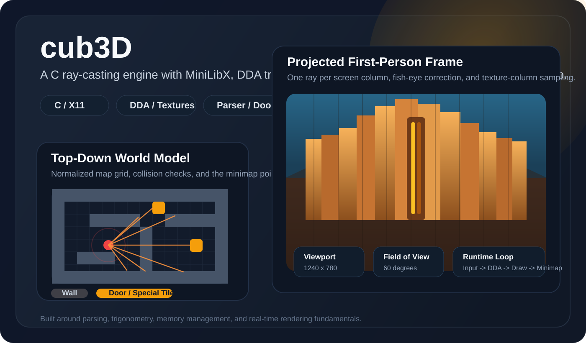
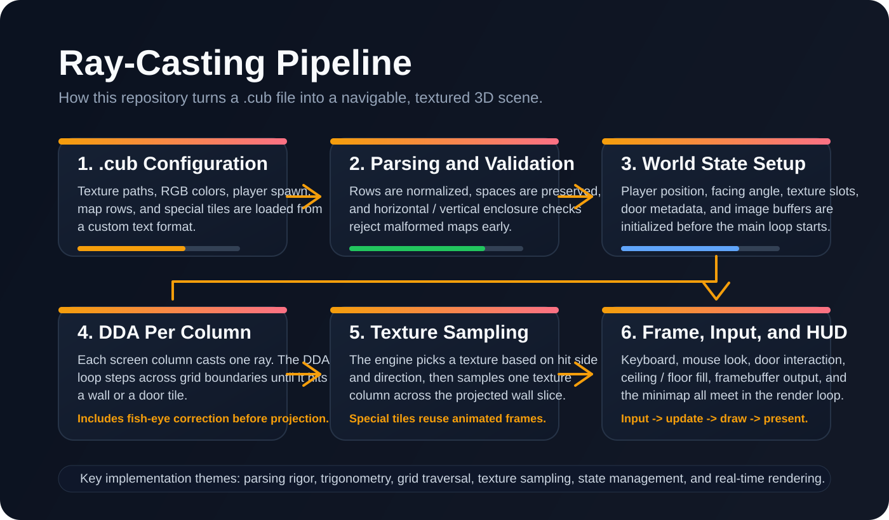
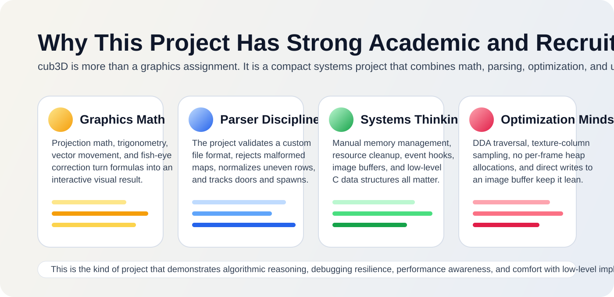

# cub3D

<p align="center">
  
</p>

`cub3D` is a Wolfenstein-inspired ray-casting engine written in C with MiniLibX. It turns a plain-text `.cub` file into a navigable 3D scene by combining custom parsing, DDA grid traversal, texture sampling, collision handling, mouse and keyboard input, minimap rendering, and door interaction.

This is the kind of project that looks small from the outside, but carries real engineering depth underneath. It sits at the intersection of graphics programming, low-level systems work, algorithmic thinking, and debugging discipline, which is exactly why it has strong academic and portfolio value.

## Project Snapshot

| Area | Details |
| --- | --- |
| Language | C |
| Graphics stack | MiniLibX on Linux/X11 |
| Rendering approach | DDA ray-casting with textured wall projection |
| Interaction | WASD movement, arrow-key rotation, mouse look, minimap, door controls |
| Input format | Custom `.cub` configuration and map format |
| Core topics | Trigonometry, parsing, collision detection, state management, manual memory cleanup |

## Why This Project Matters

<p align="center">
  
</p>

<p align="center">
  
</p>

From a recruiter or evaluator perspective, this repository demonstrates more than "I can draw walls on screen":

- translating geometry and trigonometry into visible, interactive behavior
- designing a custom parser and defending against malformed input
- organizing a medium-sized C codebase into focused modules
- reasoning about runtime performance instead of brute-forcing the problem
- handling memory, resources, and cleanup paths explicitly
- building an event-driven application with real user interaction

## What The Engine Does

At runtime, the engine:

- loads texture paths, floor and ceiling colors, and a map layout from a `.cub` file
- validates the map structure, including spaces, player spawn rules, and enclosure constraints
- initializes the player position and facing angle from `N`, `S`, `E`, or `W`
- casts one ray per screen column across a 2D grid using DDA
- corrects fish-eye distortion before projecting wall height
- selects the correct texture column depending on ray direction and hit side
- renders floor, ceiling, walls, special door tiles, and a minimap overlay
- supports live movement, rotation, mouse look, and door interaction

## Feature Highlights

- **Custom `.cub` parsing** for textures, RGB colors, map rows, and spawn orientation
- **Map normalization** so uneven row lengths can still be validated safely
- **Horizontal and vertical enclosure checks** to reject open or malformed maps
- **DDA ray traversal** for efficient wall and door detection
- **Texture-mapped wall rendering** using direct framebuffer writes
- **Fish-eye correction** to preserve perspective quality
- **Minimap overlay** centered around the player
- **Collision checks** that sample ahead of the player to reduce clipping into geometry
- **Interactive door logic** with tile-state updates
- **Frame-based animated special textures**

## Controls

| Input | Action |
| --- | --- |
| `W` | Move forward |
| `S` | Move backward |
| `A` | Strafe left |
| `D` | Strafe right |
| `Left Arrow` | Rotate left |
| `Right Arrow` | Rotate right |
| `Mouse` | Look around |
| `E` | Open the door in front of the player |
| `F` | Close the door in front of the player |
| `Esc` | Exit |

## Map Format

The project uses a simple custom configuration format:

```cub
NO ./tex/wall_1.xpm
SO ./tex/wall_2.xpm
WE ./tex/wall_3.xpm
EA ./tex/wall_4.xpm

F 220,100,0
C 110,30,0

11111111
10000021
1N000011
11111111
```

### Legend

- `1` = wall
- `0` = walkable space
- `N`, `S`, `E`, `W` = player spawn and starting orientation
- `2` = door / special interactive tile
- `F` = floor RGB color
- `C` = ceiling RGB color
- `NO`, `SO`, `WE`, `EA` = wall texture paths

## Repository Structure

```text
.
|-- includes/
|   `-- cub3d.h
|-- maps/
|-- src/
|   |-- parsing/
|   |-- dda.c
|   |-- dda_init_values.c
|   |-- ray_casting.c
|   |-- draw_frame.c
|   |-- draw_frame_utils.c
|   |-- movements.c
|   |-- movements_utils.c
|   |-- minimap.c
|   |-- doors.c
|   `-- ...
|-- tex/
|-- minilibx-linux/
`-- Makefile
```

### Main Responsibilities By Module

- `src/parsing/`: reads the `.cub` file, extracts textures and colors, normalizes map rows, validates layout constraints, and tracks doors
- `src/dda*.c` and `src/ray_casting.c`: compute ray angles, delta distances, step directions, and grid traversal
- `src/draw_frame*.c`: compute wall height, pick textures, sample texture columns, and draw ceiling and floor
- `src/movements*.c`, `src/key_hooks.c`, `src/rotation.c`: handle movement, rotation, mouse look, and collision checks
- `src/minimap.c`: draws a local top-down view around the player
- `src/doors.c`: opens and closes nearby doors by syncing logical door state and map tiles
- `src/exit_prog.c` and `src/parsing/free_close_exit.c`: centralize cleanup and resource release

## Build And Run

### Requirements

- Linux
- X11-compatible environment
- a C compiler such as `cc`
- MiniLibX dependencies required by the bundled Linux version

### Commands

```bash
make
./cub3D maps/0.cub
```

Other useful targets:

```bash
make clean
make fclean
make re
```

Sample inputs are available in `maps/`, and `test.cub` provides a compact example map. The repository also contains malformed parser cases that are useful for stress-testing validation behavior.

## Selected Technical Decisions

### 1. DDA Instead Of Naive Marching

The engine uses a Digital Differential Analyzer traversal rather than tiny forward steps along a ray. That matters because DDA jumps from grid boundary to grid boundary, which is both faster and more stable for tile-based worlds.

### 2. Fish-Eye Correction

After the first wall hit is found, the measured distance is corrected with the cosine of the angle difference between the player direction and the ray direction. This keeps walls from warping unnaturally across the screen.

### 3. Direct Framebuffer Writes

Pixels are written into an image buffer before being pushed to the window. This is a better fit for real-time rendering than drawing individual pixels directly to the window for every fragment.

### 4. Defensive Map Validation

The parser does more than check syntax. It pads rows, preserves spaces, ensures only valid characters are accepted, enforces a single spawn point, tracks door tiles, and rejects layouts that are visually open even if they look almost valid at first glance.

### 5. Lightweight Runtime State

Most runtime state is stored in structs and reused every frame. This avoids unnecessary allocations during rendering and keeps the frame loop focused on computation and drawing.

## Difficulties And Interesting Challenges

This project is especially valuable because many of the hard parts are not obvious at first:

- **Coordinate-system bugs**: one mistake in angle conversion, step direction, or tile-to-world conversion can break the whole illusion
- **Perspective correctness**: ray distance is not the same as projected distance, so fish-eye distortion must be handled explicitly
- **Parsing edge cases**: spaces, jagged rows, multiple spawns, bad colors, and broken maps all need careful validation
- **Collision feel**: movement needs to feel smooth without allowing the player to clip through corners or doors
- **State consistency**: door metadata and map tiles must stay synchronized when opening and closing
- **Resource cleanup**: every early exit path in C needs deliberate cleanup logic for images, MLX resources, textures, file descriptors, and heap allocations

In other words, the difficulty is not just "making it work", but making math, parsing, rendering, and resource management all agree with one another.

## Optimization Notes

Several implementation choices already show a performance-oriented mindset:

- DDA traversal reduces unnecessary work during ray intersection
- one ray is cast per screen column instead of using overly dense sampling
- texture mapping is done per visible column, not per off-screen surface
- the render loop reuses structs and loaded textures instead of reallocating every frame
- drawing goes through an image buffer, which is more efficient than frequent immediate window writes
- the `Makefile` uses `-O3` during compilation and includes `-fsanitize=address` for stronger memory debugging during development

This combination is worth calling out in a README because it shows awareness of both correctness and runtime cost.

## What Was Learned

This project teaches lessons that carry well beyond graphics:

- **Math becomes much more concrete when it drives a visual result.** Angles, projection distance, and vector movement stop being abstract once a single bad calculation visibly breaks the scene.
- **Parsing is a product-quality concern.** A graphics engine is only as reliable as the data it accepts, so input validation ends up being just as important as rendering.
- **The right algorithm beats micro-optimization.** Choosing DDA is a far more meaningful optimization than trying to squeeze tiny gains out of a poor traversal strategy.
- **Debugging low-level systems requires discipline.** Rendering bugs often come from data flow, units, or state transitions, not from a single obviously broken line.
- **C rewards clear ownership.** Projects like this make manual memory management, cleanup paths, and state design impossible to ignore, which is valuable training for systems work.

## Academic Value

Academically, `cub3D` is strong because it combines multiple CS concepts in a single interactive artifact:

- computational geometry and trigonometry
- parsing and input validation
- event-driven programming
- low-level graphics programming
- memory management and resource lifecycle control
- algorithmic performance tradeoffs

It is a good example of a project where theory has to survive contact with implementation details.

## Why Recruiters Tend To Like Projects Like This

Projects like `cub3D` read well in a portfolio because they signal a blend of technical depth and persistence:

- the developer had to understand the problem, not just call a high-level engine API
- the result is interactive and visual, which makes the work easy to demonstrate
- the code touches parsing, math, rendering, performance, and debugging in one place
- the implementation requires comfort with lower-level concepts that many portfolios avoid
- it shows the ability to take a medium-complexity problem from specification to working system

For roles involving systems programming, graphics, gameplay engineering, embedded work, or performance-minded backend development, this kind of project is especially relevant.

## Potential Next Improvements

If this project were extended further, the next interesting milestones would be:

- sprite rendering with depth ordering
- delta-time-based movement for frame-rate independence
- distance-based shading or lighting
- configurable resolution and field of view
- broader automated parser test coverage
- more advanced door states and interactions
- richer level design tools or map generation helpers

## Final Takeaway

`cub3D` is a strong academic and portfolio project because it proves the ability to build a real-time interactive program from low-level pieces. It demonstrates comfort with C, geometry, parsing, performance-aware thinking, and structured debugging, all in a form that is easy to explain, easy to demo, and easy for a recruiter to remember.
